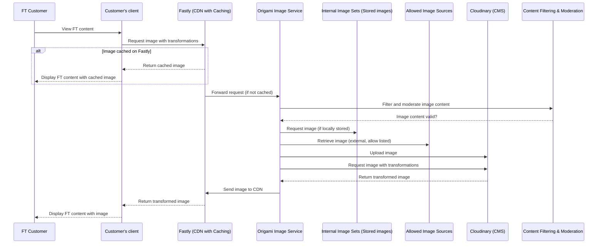

```mermaid
sequenceDiagram
    participant FT_Customer as FT Customer
    participant Client as Customer's client
    participant Fastly as Fastly (CDN with Caching)
    participant Origami as Origami Image Service
    participant ImageSet as Internal Image Sets (Stored images)
    participant ImageSource as Allowed Image Sources
    participant Cloudinary as Cloudinary (CMS)
    participant Validation as Content Filtering & Moderation

    FT_Customer->>Client: View FT content
    Client->>Fastly: Request image with transformations
    alt Image cached on Fastly
    Fastly-->>Client: Return cached image
    Client-->>FT_Customer: Display FT content with cached image
    end
    Fastly->>Origami: Forward request (if not cached)

    Origami->>Validation: Filter and moderate image content
    Validation-->>Origami: Image content valid?

    Origami->>ImageSet: Request image (if locally stored)
    Origami->>ImageSource: Retrieve image (external, allow listed)

    Origami->>Cloudinary: Upload image
    Origami->>Cloudinary: Request image with transformations
    Cloudinary-->>Origami: Return transformed image

    Origami->>Fastly: Send image to CDN
    Fastly-->>Client: Return transformed image
    Client-->>FT_Customer: Display FT content with image
```
